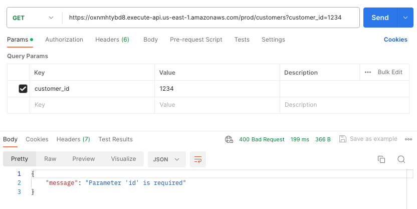

## Mission 1 - DynamoDB REST API

### Table of contents
* [DynamoDB](#dynamodb)
* [Lambda Function](#lambda-function)
* [API Gateway](#api-gateway)
* [Testing the API](#testing-the-api)
<br>


<br>

### DynamoDB

1. Create a new DynamoDB table in the DynamoDB console.

2. Table name: `customer_ids`

3. Partition key: `id`

4. Create table.
<br>

### Lambda Function

1. Create a new function in the Lambda console.

2. Function name: `dynamodb-rest-api`

3. Give the Lambda Function permissions
   We want to give the Lambda function only the relevant permissions.
   - Permissions → Change default execution role → Create a new role from AWS
   - Role name: `lambda-dynamodb-rest-api`
   - In the Policy templates box type `Simple microservice permissions` and press on the suggested option.

4. Press `Create function`.

The Lambda function creation looks like this:


**Note:**
Another option to give the Lambda function permissions is to manually create the following custom policy, which follows the least privilege principle:

```json
{
    "Version": "2012-10-17",
    "Statement": [
        {
            "Effect": "Allow",
            "Action": "logs:CreateLogGroup",
            "Resource": "arn:aws:logs:<region>:<account_id>:*"
        },
        {
            "Effect": "Allow",
            "Action": [
                "logs:CreateLogStream",
                "logs:PutLogEvents"
            ],
            "Resource": [
                "arn:aws:logs:<region>:<account_id>:log-group:/aws/lambda/dynamodb_crud:*"
            ]
        },
        {
            "Effect": "Allow",
            "Action": [
                "dynamodb:GetItem",
                "dynamodb:PutItem"
            ],
            "Resource": "arn:aws:dynamodb:<region>:<account_id>:table/customer_ids"
        }
    ]
}
```

5. Write the lambda function code.
<br>

### API Gateway

We’ll create an API Gateway resource with 2 methods:\
`GET` - Checking whether a customer is in the DynamoDB table.\
`PUT` - Update the DynamoDB table with a new customer.

1. Create an API in the API Gateway console.

2. Choose `REST API`.\
   **Note:** We can also use `HTTP API` for this mission.

3. API name: `dynamodb-rest-api`<br>
   

4. Create API resource.\
   Resource name: `customers`<br>
   

5. Create `GET` method.
   The method is integrated with the lambda function `dynamodb-rest-api`.<br>
   

6. Create `PUT` method.
   The method is integrated with the lambda function `dynamodb-rest-api`.<br>
   

7. API routes:<br>
   

8. Deploy the API.<br>
   On the right hand side, press `Deploy API`.<br>
   

9. The API can be accessed through the `Invoke URL` we got in the API stage.
<br>

### Testing the API

**GET request**

1. `id` is in DynamoDB table:<br>
   

2. `id` is not in DynamoDB table:<br>
   

3. Parameter `id` is missing:<br>
   
<br>

**PUT request**

1. Adding `id` to DynamoDB table:<br>
   

2. Parameter `id` is missing:<br>
   
